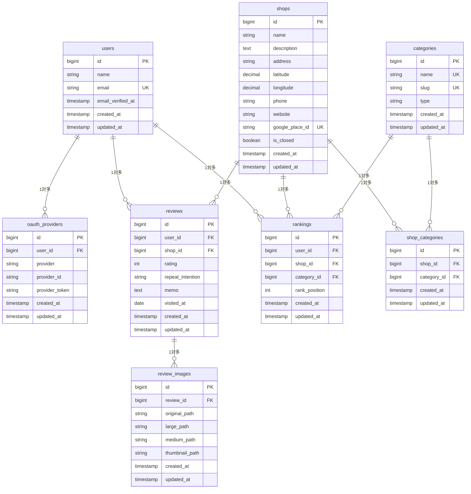

# データベース設計 - ER図

## テーブル一覧

### ユーザー関連
- `users` - ユーザー情報
- `oauth_providers` - OAuth連携情報

### 店舗関連
- `shops` - 店舗情報
- `categories` - カテゴリマスタ
- `shop_categories` - 店舗カテゴリ中間テーブル

### レビュー関連
- `reviews` - 店舗レビュー
- `review_images` - レビュー画像

### ランキング関連
- `rankings` - ユーザー別ランキング

## ER図



## テーブル詳細

### categories テーブルの初期データ
```sql
-- 基本カテゴリ
INSERT INTO categories (name, slug, type) VALUES
('ラーメン', 'ramen', 'basic'),
('定食・食堂', 'teishoku', 'basic'),
('居酒屋・バー', 'izakaya', 'basic'),
('カフェ・喫茶店', 'cafe', 'basic'),
('ファストフード', 'fastfood', 'basic'),
('その他', 'others', 'basic'),

-- 時間帯タグ
('ランチ営業', 'lunch', 'time'),
('深夜営業', 'late-night', 'time'),
('朝営業', 'morning', 'time'),

-- 特別カテゴリ（ランキング用）
('総合', 'overall', 'ranking');
```

### repeat_intention の値
- `また行く` - また行きたい
- `わからん` - 微妙・どちらとも言えない
- `行かない` - もう行かない

## 実装状況

### Phase 1: Authentication & Foundation ✅
- [x] 全テーブルのマイグレーション作成
- [x] 全モデル作成（User, OAuthProvider, Shop, Category, Review, ReviewImage, Ranking）
- [x] CategorySeeder作成（基本カテゴリ、時間帯タグ、ランキング用）
- [x] JWT + OAuth認証システム実装
- [x] 認証システムテスト完了 (13/13 成功)

### 作成済みマイグレーション
1. `2014_10_12_000000_create_users_table.php`
2. `2025_07_08_070857_create_oauth_providers_table.php`
3. `2025_07_08_070858_create_shops_table.php`
4. `2025_07_08_070859_create_categories_table.php`
5. `2025_07_08_070900_create_shop_categories_table.php`
6. `2025_07_08_070901_create_reviews_table.php`
7. `2025_07_08_070902_create_review_images_table.php`
8. `2025_07_08_070903_create_rankings_table.php`

### 作成済みモデル
- `User.php` (JWT + OAuth関係実装済み)
- `OAuthProvider.php` (Factory実装済み)
- `Shop.php`
- `Category.php`
- `Review.php`
- `ReviewImage.php`
- `Ranking.php`

### 認証システム実装状況
- **JWT認証**: 1週間有効期限、リフレッシュ機能なし
- **OAuth対応**: Google, GitHub, LINE, Twitter (Laravel Socialite)
- **テストカバレッジ**: AuthenticationTest (6/6), UserModelTest (7/7)
- **API保護**: 認証が必要なエンドポイントの適切な保護

### Phase 2: Business Logic API (次のステップ)
- [ ] 店舗管理API (Shop, Category関連)
- [ ] レビュー機能API (Review, ReviewImage関連)
- [ ] ランキング機能API (Ranking関連)
- [ ] 画像アップロード機能 (Intervention Image)