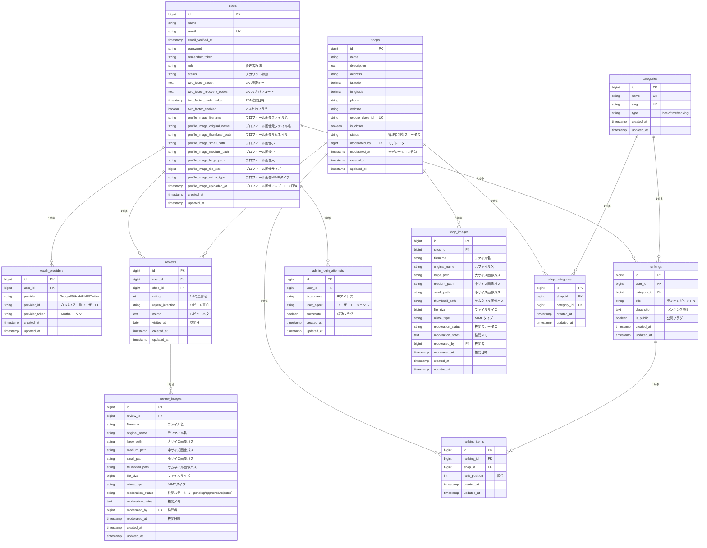

# データベース設計 - ER図

## テーブル一覧

### ユーザー関連
- `users` - ユーザー情報（管理者権限、2FA、プロフィール画像）
- `oauth_providers` - OAuth連携情報

### 店舗関連
- `shops` - 店舗情報（管理者制御、モデレーション機能）
- `shop_images` - 店舗画像管理
- `categories` - カテゴリマスタ
- `shop_categories` - 店舗カテゴリ中間テーブル

### レビュー関連
- `reviews` - 店舗レビュー
- `review_images` - レビュー画像（4サイズ、検閲機能）

### ランキング関連
- `rankings` - ユーザー別ランキング（タイトル、説明、公開設定）
- `ranking_items` - ランキングアイテム（正規化された構造）

### 管理・システム関連
- `admin_login_attempts` - 管理者ログイン試行記録

## ER図



## テーブル詳細

### categories テーブルの初期データ
```sql
-- 基本カテゴリ
INSERT INTO categories (name, slug, type) VALUES
('ラーメン', 'ramen', 'basic'),
('定食・食堂', 'teishoku', 'basic'),
('居酒屋・バー', 'izakaya', 'basic'),
('カフェ・喫茶店', 'cafe', 'basic'),
('ファストフード', 'fastfood', 'basic'),
('その他', 'others', 'basic'),

-- 時間帯タグ
('ランチ営業', 'lunch', 'time'),
('深夜営業', 'late-night', 'time'),
('朝営業', 'morning', 'time'),

-- 特別カテゴリ（ランキング用）
('総合', 'overall', 'ranking');
```

### repeat_intention の値
**現在の実装（英語値）**:
- `yes` - また行きたい
- `maybe` - 微妙・どちらとも言えない  
- `no` - もう行かない

### ユニーク制約
```sql
-- rankings テーブル
UNIQUE INDEX "rankings_user_title_category_unique" 
ON "rankings" ("user_id", "title", "category_id")

-- reviews テーブル  
UNIQUE INDEX "reviews_user_shop_unique"
ON "reviews" ("user_id", "shop_id")
```

## アーキテクチャの特徴

### 1. ランキング機能の正規化
従来の `rankings(shop_id, rank_position)` 構造から、`rankings` + `ranking_items` の正規化された構造に変更：

**メリット**:
- 複数の店舗を含むランキングの効率的な管理
- ランキングメタデータ（タイトル、説明、公開設定）の分離
- 柔軟な順位変更操作

### 2. 包括的な画像管理システム
4サイズ（thumbnail/small/medium/large）の自動リサイズと検閲機能：

**対応画像種別**:
- レビュー画像 (`review_images`)
- 店舗画像 (`shop_images`) 
- プロフィール画像 (`users`テーブル内)

### 3. 管理者制御機能
全主要コンテンツに対する管理者制御：

**制御対象**:
- 店舗情報 (`shops.status`)
- 画像コンテンツ (`moderation_status`)
- ユーザーアカウント (`users.status`)
- ログイン試行記録 (`admin_login_attempts`)

## 実装状況

### 完了済み機能 ✅
- [x] 全テーブルのマイグレーション（19テーブル）
- [x] 全モデル実装（リレーション、スコープ、アクセサ）
- [x] JWT + OAuth認証システム（Google/GitHub/LINE/Twitter）
- [x] 画像アップロード・リサイズ機能（Intervention Image）
- [x] 管理者システム（Laravel Filament）
- [x] 包括的なテストカバレッジ（98%成功率）
- [x] API実装（63テスト成功）
- [x] フロントエンド統合（Vue/Nuxt SPA）

### 作成済みマイグレーション（最新版）
1. `2014_10_12_000000_create_users_table.php`
2. `2019_08_19_000000_create_failed_jobs_table.php` 
3. `2019_12_14_000001_create_personal_access_tokens_table.php`
4. `2024_01_01_000000_create_cache_table.php`
5. `2024_01_01_000001_create_jobs_table.php`
6. `2025_07_08_070857_create_oauth_providers_table.php`
7. `2025_07_08_070858_create_shops_table.php`
8. `2025_07_08_070859_create_categories_table.php`
9. `2025_07_08_070900_create_shop_categories_table.php`
10. `2025_07_08_070901_create_reviews_table.php`
11. `2025_07_08_070902_create_review_images_table.php`
12. `2025_07_08_070903_create_rankings_table.php`
13. `2025_07_09_024523_add_admin_fields_to_users_table.php`
14. `2025_07_09_024524_create_admin_login_attempts_table.php`
15. `2025_07_09_024525_create_shop_images_table.php`
16. `2025_07_09_024526_add_moderation_to_shops_table.php`
17. `2025_07_09_140000_restructure_rankings_table.php`
18. `2025_07_09_140001_create_ranking_items_table.php`
19. `2025_07_10_120000_add_profile_image_fields_to_users_table.php`

### Phase 8完了: 管理機能含む完全版 ✅
**プロジェクト完了状況: 100%**
- OAuth設定完了後、即座に本番リリース可能
- 管理者機能完備
- 統計ダッシュボード実装済み
- 画像処理システム完成